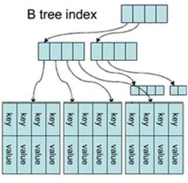
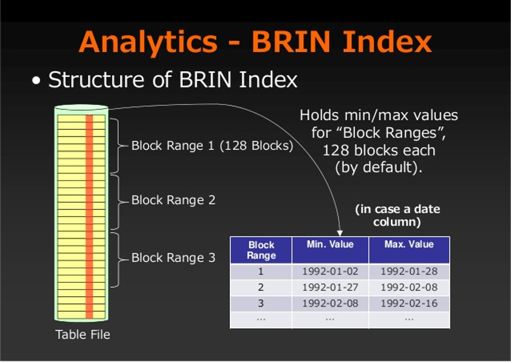
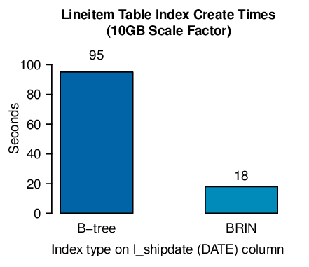
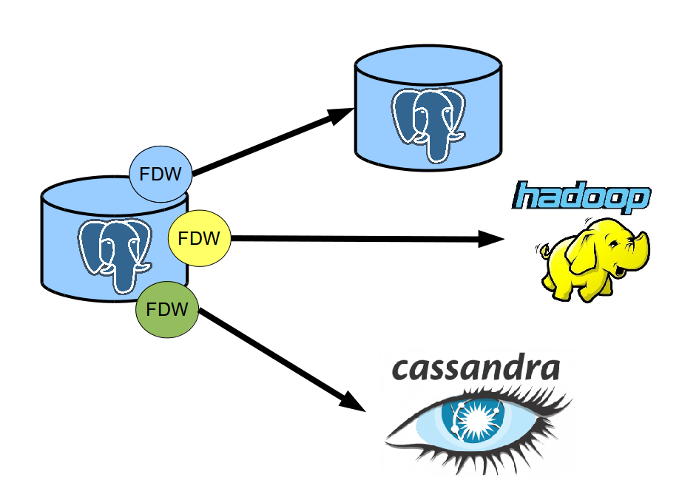

background-image: url(big_jumbo.png)

#### Postgres 9.5<br />for Big Data

.sigblock[
Josh Berkus

Red Hat OSAS

PDXPUG 3/16
]

.leftlogo[]

---

## Me

* PostgreSQL Core Team
* DBA since 1995
* Helped create Greenplum
* Involved with PipelineDB and CitusData

---


---

## Big data features

* Sophisticated SQL parser/planner
* Works with most DW tools
* Many large DB features (partitioning, etc.)
* FDWs (more later)
* Stability & Reliability

---

## Postgres Data Sizing

Comfort Zone: 1 GB to 10 TB

Possible: 10 TB to 100 TB

With Extensions: ???

---

## 9.5 Status

Beta 2 Released Nov. 12

Final in a few weeks

Test now!

---

## 9.5 Big Data Features

* UPSERT
* BRIN indexes
* GROUPING SETS / CUBE
* Foreign Schema
* Faster Sorts
* Misc
* Beyond 9.5

---

background-image: url(big_postgres.png)

# UPSERT

---

## UPSERT

Actual Syntax:

```sql
INSERT ... ON CONFLICT
DO { UPDATE | IGNORE }
```

Similar to MERGE, only better

---

## Why you want this

* works for large sets of rows
* supports complex logic
* supports cascading
* rewrite procedural ETL logic as single SQL statements
* faster (sometimes)

---

background-image: url(big_postgres.png)

# BRIN

---

## BRIN

* Stands for Block-Range INdex
* New index type
* Also knowns as "skiplist" index
* Similar to Column Store
* Works on naturally ordered data

---

## Why you want this

Very small indexes for very large data

---

## BTree



---



---

## Index Loading



---

## BRIN sizing

```
    relname     | pg_size_pretty
----------------+----------------
 brin_example   | 3457 MB
 brin_index     | 104 kB
 brin_index_256 | 64 kB
 brin_index_512 | 40 kB
 brin_index_64  | 192 kB
 btree_index    | 2142 MB
```
---

background-image: url(big_postgres.png)

# GROUPING SETS,<br />ROLLUP and CUBE

---

## ROLLUP

Get subtotals and totals with detail in one query.

```
    SELECT country, city, count(*)
    FROM lwn_subscribers
    GROUP BY ROLLUP ( country, city );
```

---

## CUBE

Get and explosion of all possible summaries for use with OLAP tools.

```
    SELECT country, level, count(*)
    FROM lwn_subscribers
    GROUP BY CUBE ( country, level );
```

---

## GROUPING SETS

Superset/programmable version of both ROLLUP and CUBE

```
    SELECT city, level, count(*)
    FROM lwn_subscribers
    GROUP BY GROUPING SETS
       ((city, level),(level),());
```

---

## Why you want this

Complex summary reports in one trip to the database.

Do OLAP in the database instead of outside.

---

background-image: url(big_postgres.png)

# Faster Sorts

---

## Abbreviated Key Sorting

* Sort Varlena data by key prefix instead of by value
* Works with TEXT, VARCHAR, NUMERIC
* 2X to 20X faster
* Much faster index builds

---

## Why you want this

Duh.

---

## How to use faster sorts

It just works.

---

background-image: url(big_postgres.png)

# Foreign Schema

---

## What's an FDW?

Foreign Data Wrapper

Lets PostgreSQL access external data like it was a local table.

```sql
CREATE FOREIGN TABLE myredishash
  (key text, val text[])
  SERVER redis_server
  OPTIONS (database '0', tabletype 'hash',
    tablekeyprefix 'mytable:');

INSERT INTO myredishash (key, val)
   VALUES ('mytable:r1,
     '{prop1,val1,prop2,val2}');
```

---

## FDWs Rule the Universe



---

## Many FDWs available

* Postgres
* MySQL, Oracle
* Cstore
* Hadoop/Hive
* Cassandra, Redis
* CSV
* Twitter

---

## Import Foreign Schema

Copy an entire target database in one command.

```sql
 IMPORT FOREIGN SCHEMA public
   EXCEPT (reports, audit)
   FROM SERVER acctng_server INTO acctng;
```

---

## Foriegn Table Inheritance

Data federation using PostgreSQL partitioning.

```sql
create foreign table users_shard_1 ()
INHERITS (users) server shard_1
options ( table_name 'users' );
create foreign table users_shard_2 ()
INHERITS (users) server shard_2
options ( table_name 'users' );
create foreign table users_shard_3 ()
INHERITS (users) server shard_3
options ( table_name 'users' );
```

---

## Why you want this

Ad-hoc Sharding

(but also check out pg_shard)

---

background-image: url(big_postgres.png)

#### More Features

---

## Set LOGGED/UNLOGGED

Use unlogged tables for ELT, then persist them.

```sql

ALTER TABLE july_data SET LOGGED;

```

---

## GiST Index-Only Scan

Index-only scan for PostGIS, Exclusion

```
->  Index Only Scan using meeting_exclusion on meetings  
->  (cost=0.41..1113.98 rows=36038 width=4)
    Index Cond: (reservation && '
    ["2014-05-01 00:00:00+01","2014-05-31 00:00:00+01"]'::tstzrange)

```

---

## WAL Compression

Reduce PostgreSQL log writes during data loading

Less writing == faster load

---

## TABLESAMPLE

Get a "quick look" at data in a big table.

```
SELECT * FROM user_profiles
TABLESAMPLE BERNOULLI ( 0.001 );
```

---

background-image: url(big_postgres.png)

#### Beyond 9.5

---

## 9.6: Parallel Seq Scan

Finally, parallel query for Postgres

```sql
set max_parallel_degree = 4;
select * from pgbench_accounts
where filler like '%a%';
                 QUERY PLAN                 
---------------------------------------------
 Gather
   Number of Workers: 4
   ->  Parallel Seq Scan on pgbench_accounts
         Filter: (filler ~~ '%a%'::text)

```

---

## cstore & pg_shard

extensions from CitusData

cstore: column-store for Postgres

pg_shard: automated DW sharding

---

## Big Data Forks Go OSS

PipelineDB: August 2015

Greenplum: November 2015

CitusDB: March? 2016

---

## ¿questions?

.left-column[
more<br />jberkus:


more<br />events:
]

.right-column[
www.projectatomic.io<br />
www.databasesoup.com<br />
jberkus.github.io

pgCon:<br />
May 21, Ottawa

pgConfSV<br />
Nov. 16, San Francisco
]

.leftlogo[]

.rightlogo[]
