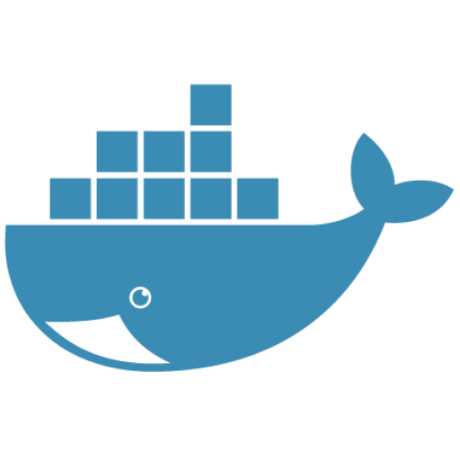
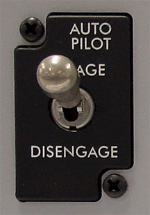

background-image: url(elephant-shelter.jpg)

#### Containerized Clustered PostgreSQL

.sigblock[
Josh Berkus

Red Hat OSAS

pgConfSV 2016
]

.leftlogo[]

---

github.com/jberkus/atomicdb

---

### A Long Strange Journey

---

---

---

>The way containers are designed, and particularly the way Docker is designed, the assumption is that the container is stateless. -- Mark Davis, ClusterHQ

---

---

.left-column[

]

.left-column[

]

---

## PetSet / StatefulSet

Kubernetes API for stateful applications,
introduced in 1.4 (still alpha)

* storage
* routing
* identity
* persistence

---

#### Why Containerize?

---

## Pro-container

* easy install/configure
* service encapsulation
* prevent "hot-fixes"
* ease of dev and testing
* orchestration

---

## Pro-orchestration

* auto-vivification
* deploy & configure in groups
* manage routing
* built-in HA/DR
* self-service for devs
* manage everything in one place

---

_manage PostgreSQL as a cluster ecosystem, instead of as a bunch of servers_

---

## Anti-container

* extra setup
* change admin, config, monitorning tools
* possible performance issues
* no efficiency benefit for databases
* _everything is alpha_

---

This is your _future_ infrastructure.

---

#### Enough Talking, Let's See Some Code!

---

## Prototypeishness

* still working on some of the alpha features
* some productions examples exist already (Spilo)
* others in ~~ 6 months

---

### Bots Not Cattle

---

### Autopilot Pattern

---

## Bots/Autopilots

Each containerized application is programmed
using a simple state machine
to be an intelligent part of a clustered
ecosystem.

---

## Container Considerations

* log to stdout/stderr
* need bootstrap script
* install config, hba
* set up initial users

---

## PV or Not PV?

* Big Databases: want persistent volumes
* Small Databases: use ephemeral storage, make lots of replicas.

---

#### Productionizing

---

## Add to Patroni/Citus

* Persistent Volume configs
* Vault support
* Sidecar containers (backup, admin)
* Failover for query node
* Failover for shards

---

## More Clusters!

* Postgres Pro MM Clustering
* BDR (with Federation?)
* PostgresXL

---

## Waiting for Kube

* Union ConfigMap
* Federated StatefulSets
* Node Affinity (1.5)
* Fix issues (PVs, etc.)
* Vault plugin

---

## Resources

* This Presentation:
   jberkus.github.io/container_cluster
* Simplified Configuration Scripts:
   github.com/jberkus/atomicdb/
* Crunchy Data Containers:
   

---

## Spilo Resources

* Patroni Project:
   github.com/zalando/patroni
* Spilo Project:
   github.com/zalando/spilo
* Helm Chart:
   github.com/kubernetes
   /charts/incubator/patroni

---

### Thanks, Zalando!

---

# ¿questions?

.left-column-narrow[
more jberkus:

project atomic:

&nbsp;
]

.right-column-wide[
@fuzzychef 
www.databasesoup.com 
jberkus.github.io

www.projectatomic.io

&nbsp;
]

.leftlogo[]

.rightlogo[]
