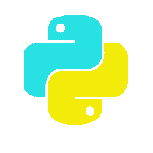

.sigblock[
Josh Berkus<br />
PostgreSQL Experts<br />
SFPython Nov. 2015<br />
]

.leftlogo[]

---

.left-column[]

.right-column[]

---

## virtualenv +=

* run different versions of pip packages
* update libs without clobbering system
* test different python environments
* document python requirements

---

## virtualenv -=

* can't version python itself
* c library dependancies
* system package dependancies
* poor script/tool integration
* PYTHONHOME/PYTHONPATH

---

## not very deployable

* build at install time
* missing dependancies

---


---

## libs | userspace | OS

---

## docker +=

* different versions of python (3!)
* version c libraries
* scripts/tools just work
* no PYTHONHOME
* simulate production
* test in different envs

---

## docker deployable

docker hub

development->production

---

## docker -=


---

## docker toolbox


---

## docker -=

```
REPOSITORY          VIRTUAL SIZE
jberkus/scipypostgis    645.9 MB
jberkus/patroni-node    536.5 MB
<none>                  470.1 MB
<none>                  470.1 MB
<none>                  190.1 MB
pipelinedb/pipelinedb   429.4 MB
```

---

## sharing files

use --volume

annoying, but
you remember file reqs

---

## dockerfile

```bash
FROM python/3.2

RUN pip install flask

RUN pip install -r \
     /project/requirements

CMD /bin/bash
USER root
```

---

## practical tips

1. create your own parent images

2. have a common tree for volumes

3. several dockerfiles per project

4. use docker-compose for DBs

---


.sigblock[
Josh Berkus<br />
PostgreSQL Experts<br />
SFPython Nov. 2015<br />
]

.leftlogo[]


