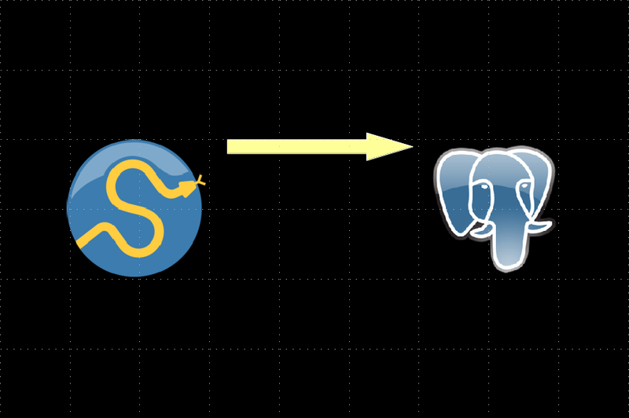
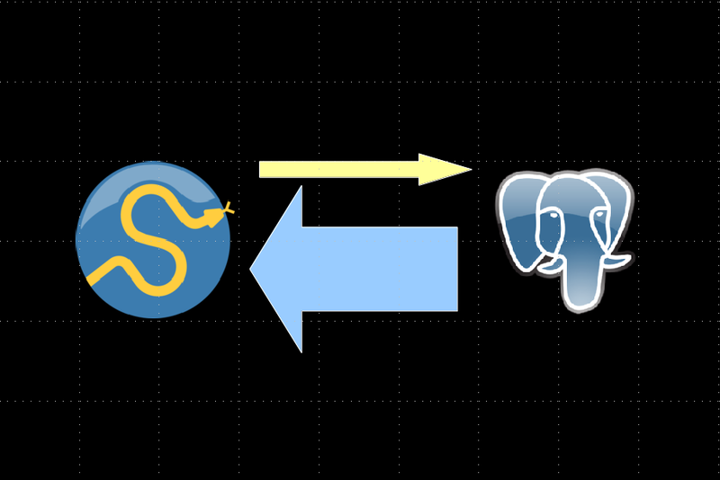
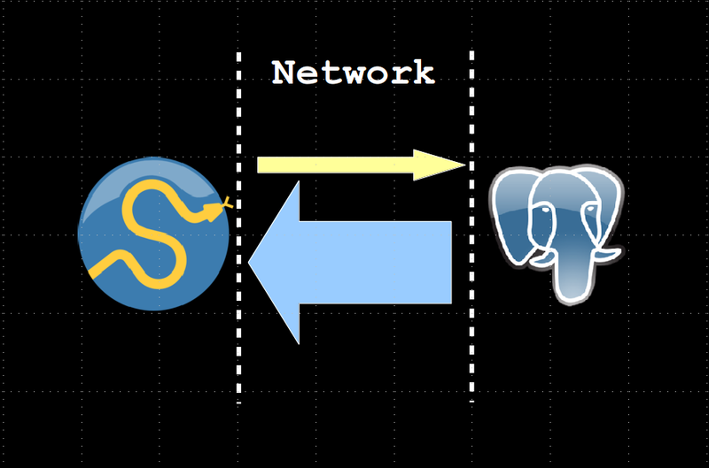
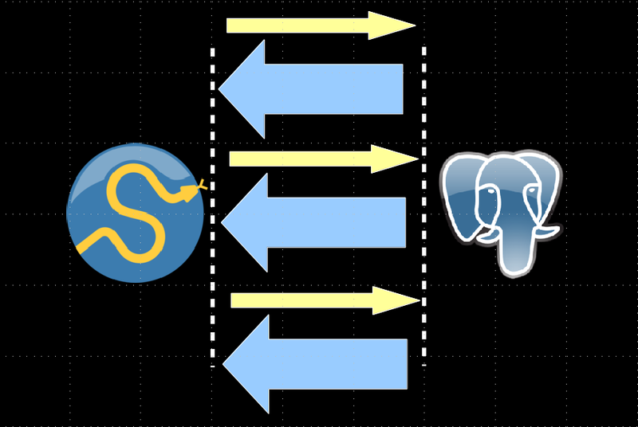
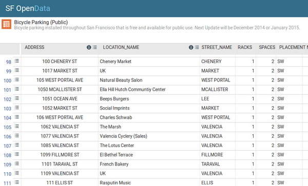

## Postgres + Python<br />For Great Stats!


.sigblock[
Josh Berkus<br />
PostgreSQL Experts<br />
PyDX 2015
]

.leftlogo[]

---

## SciPy is Awesome

.left-column[

]

.right-column[
* stats functions
* significance tests
* easier than R
* speedy
* graphs!
]

---

## PostgreSQL is Awesome

.left-column[

]

.right-column[
* holds big data
* super-durable
* concurrency engine
* indexed operations
* GIS
]

---

## Two great tastes?

.left-pic[]
.right-pic[]

---

.center[]

---



---



---



---

## keep the computations<br />close to the data

* aggregation
* window calculations
* spill-to-disk
* correlations

---

## What's a PL?

PL == "procedural language"

Lua, Ruby, Perl, Tcl, JS, Java

... and Python

---

## installing plpython

1. install package

```bash
apt-get install postgresql-plpython-9.4
```
    
2. install extension

```sql
create extension plpythonu
```

---

## What's it to "U"

PL/python is "untrusted"

* needs superuser access
* functions can access files, network
* not available on Heroku, RDS, etc.

---

## Postgres stuff for SciPy

* arrays
* hstore/JSON
* aggregates
* windowing queries
* materialized views
* PostGIS

---

## Don't Park Your Bike There!



---

```python
create or replace function chisq_p(
    popvals float[] )
returns float
language plpythonu
as $f$
    from scipy import stats
    popmean, p = stats.chisquare(popvals)
    return p
$f$;
```

---

## next step: custom aggregate

create your own MAX()/SUM()

only do cooler stuff

CHISQ()

---

```sql
create aggregate chisq_agg ( float ) (
    initcond = '{}',
    sfunc = array_append,
    stype = FLOAT[],
    finalfunc = chisq_p
);
```
---

# some postGIS goodness

```sql
create table rackthefts as
    select location_name, bikeparking.address, 
        count(*)/racks::float as thefts
    from bikeparking
        join crimedata
        on st_dwithin(bikeparking.location, 
            crimedata.location, 50)
            and crimedata.description 
                ilike '%bicycle%'
    group by location_name, 
        bikeparking.address, racks;
```

---

# is it significant?

```sql
select chisq_agg(thefts)::numeric
from rackthefts;
```

---

```python
create or replace function std_compare(
    val float, popvals float[])
returns float
language plpythonu
as $f$
    import numpy
    std = numpy.std(popvals)
    avg = numpy.mean(popvals)
    stdvar = ( val - avg ) / std
    return stdvar
$f$;
```
---

# windowing

```sql
with racktheft_window as (
    select rackthefts.*, 
        array_agg(thefts) over () as all_thefts
    from rackthefts
)
select location_name,
    address,
    std_compare(thefts, all_thefts) as risk_factor
from racktheft_window
order by risk_factor desc;
```
---

# ¿questions?

.left-column[
more<br />jberkus:


more<br />events:
]

.right-column[
www.pgexperts.com<br />
www.databasesoup.com

pgConfSV:<br/>
Nov. 18, San Francisco

SCALE:<br />
Jan. 21, Los Angeles
]

.leftlogo[]

.rightlogo[]


